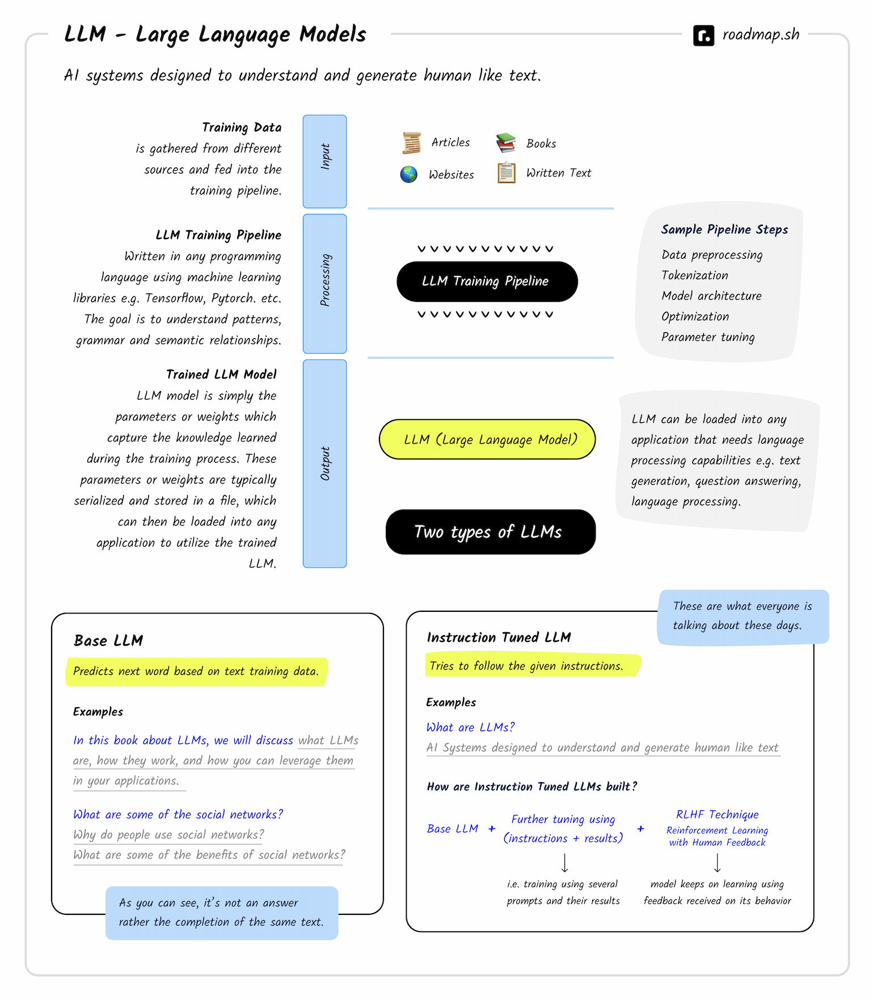

# What are LLMs?

LLM stands for “Large Language Model.” These are advanced AI systems designed to understand and generate human-like text based on the input they receive. These models have been trained on vast amounts of text data and can perform a wide range of language-related tasks, such as answering questions, carrying out conversations, summarizing text, translating languages, and much more.

OpenAI has been a major contributor to this space in the past few years with their models and research. However, there are other players in the market as well e.g. Meta with their OPT, OPT-IML and LLaMA models, Google released FLAN-T5 and BERT, StableLM by Stability AI, Alpaca at Stanford and there are many other opensource models as well.
